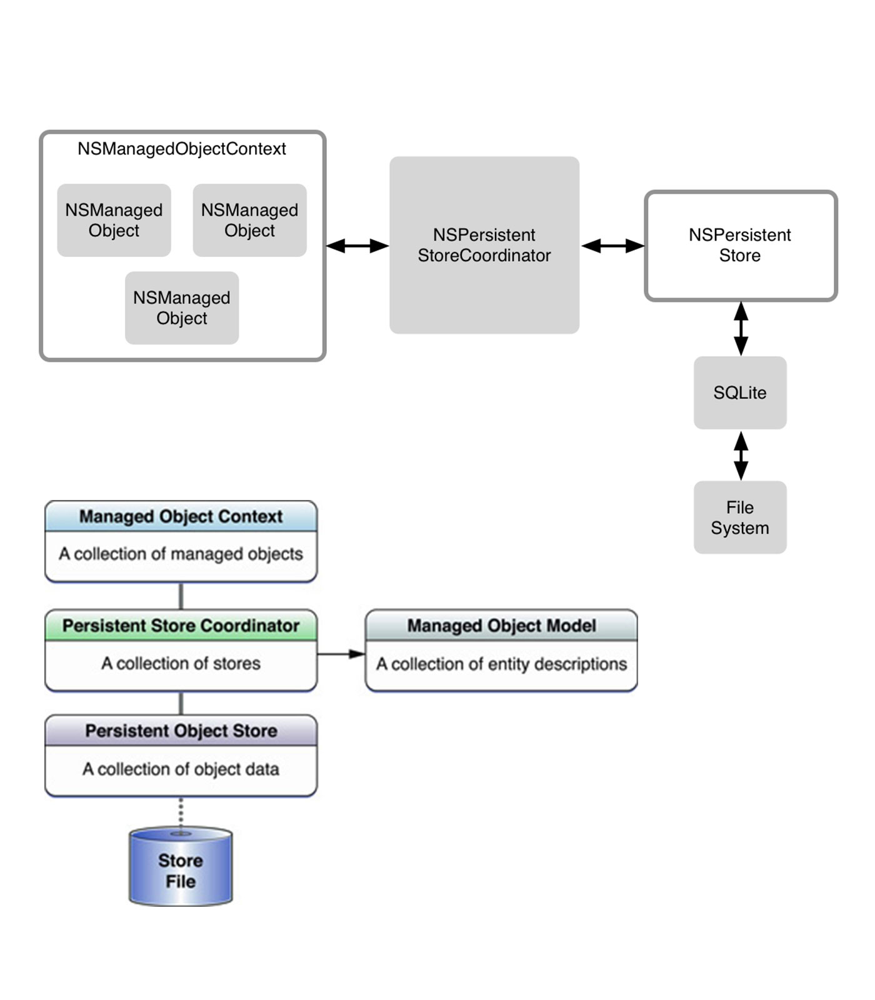
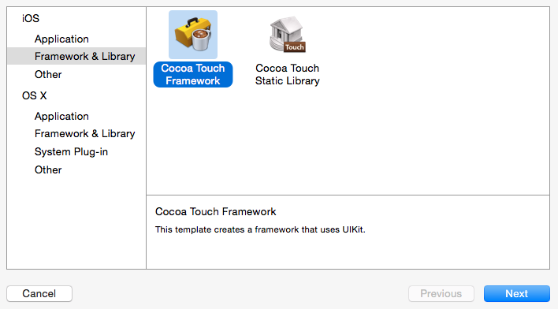
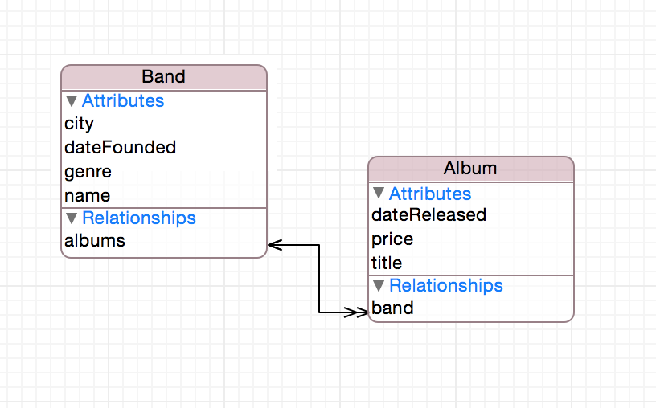
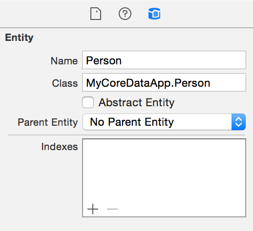

<br/>

# [fit] Using Core Data in Swift

### *Jesse Squires*

<br/>

#### *jessesquires.com* • *@jesse_squires* • *github/jessesquires*

^Thanks for coming

^Thanks to Realm

^Today talking about Core Data

---

## What is Core Data?

^Brief overview

^Who has used Core Data?

^Who has shipped a Core Data app?

---

The *Core Data* framework provides generalized and automated solutions to common tasks associated with *object life-cycle* and *object graph management*, including *persistence*.

<br/>

— [Core Data Programming Guide](https://developer.apple.com/library/mac/documentation/Cocoa/Conceptual/CoreData/Articles/cdTechnologyOverview.html#//apple_ref/doc/uid/TP40009296-SW2)

---

*Core Data* is backed by a SQLite database.

However, it is *not* a relational *database* or RDBMS.

---

# [fit] *Backed by SQLite.*

# [fit] Not a database?


---

## Core Data manages:

### *Life-cycle*
### *Graph*
### *Persistence*
### *Searching*
### of Objects

^CoreData vs SQL

^Different features, examples:

^Cons: marking RSS articles "unread", deleting lots of items

^Pros: connect A to B and connection kept in sync, cascade deletes

^A lot of resources online to learn more

---

# [fit] Core Data Stack:

*Managed objects*
`NSMangedObject`

*Managed object context*
`NSManagedObjectContext`

*Persistent Store Coordinator*
`NSPersistentStoreCoordinator`

*Persistent Store*
`NSPersistentStore`

*SQLite*



^Begin with objects

^Like NSObject but with CD behaviors/properties

^Context is a scratch pad

^Coordinator manages stores

^PersistentStore represents DB

^Mostly deal with managed objects and context

---

# [fit] *Why use Core Data?*

* Provides featues you need
* "Mature, unit tested, optimized"
* Part of iOS and OS X toolchain
* Apple continues to invest heavily in it
* Popular, tons of resources online

^Obviously, need to store and display data

^Part of the platform, not 3rd party

^New features introduced at WWDC 14

^Long term support

^Probably good for most situations

---

# [fit] *Why use Swift?*

* Clarity
* Type-safety
* Swift-only features
* Functional paradigms

^What can Swift bring to Core Data?

^Why change from ObjC?

^Expressiveness

^Type-safety

^Enums, optionals, etc.

---

# [fit] *Swift* + *Core Data*

^Let's get started

---

# Warning: *Tools are immature*

`SourceKitService`
`Terminated`
`Editor functionality`
`temporarily limited.`


^Unstable tools, but improving

^As you already know, frustrating

^We'll talk more as we go

^Visual editor > generate classes

^Mainly, class generation

---

# [fit] Standing up the
# [fit] Core Data Stack

*Same boilerplate code as Objective-C*
Better in Swift

^First step

^Create models & relationships with same visual editor, same process

^We'll encapsulate that into 2 main objects

---

# Core Data Stack

````swift
struct CoreDataModel {

   let name: String

   let bundle: NSBundle

   init(name: String, bundle: NSBundle)

   // other properties & methods
}
````

^Represents our model file

^Helpers for storeURL, modelURL, checking migrations, etc.

---

# Core Data Stack

````swift
class CoreDataStack {

   let model: CoreDataModel

   let managedObjectContext: NSManagedObjectContext

   let persistentStoreCoordinator: NSPersistentStoreCoordinator

   init(model: CoreDataModel,
        storeType: String,
        concurrencyType: NSManagedObjectContextConcurrencyType)

   // other properties and methods
}
````

^Represents our stack

^Default parameter values!, single init

^Helpers for child contexts

---

# Core Data Stack

````swift
let model = CoreDataModel(name: "MyModel", bundle: myBundle)

let stack = CoreDataStack(model: model,
                          storeType: NSSQLiteStoreType,
                          concurrencyType: .MainQueueConcurrencyType)

// Use context
stack.managedObjectContext
````

^Represents our stack

---

# Core Data Stack

*`AppDelegate.m`*


# Do not

^Do not use Xcode template!

^Do not setup stack in AppDelegate!

---

# Use frameworks

*Clear model namespace, Modular, Reusable, Unit Testing*



^Adding NSManagedObject classes to both targets seg faults compiler

^No need to worry about targets, import Model to AppTest and TestTarget

^Hacks on StackOverflow > modify model file

^Use for Watch App

^Use for Mac App

---

# [fit] Creating Managed Objects

* *Xcode generated classes are terrible*
* *mogenerator Swift support still experimental*
(Last release Sept 2014)


^Next step

^Add and generate models

^Using Xcode classes will crash, more later

---

# Creating Managed Objects
## *Visual model editor*



---

# Creating Managed Objects
## *Attribute validation*


^Rules and constraints on data

^Validated on saving context

---

# Objective-C

````objectivec

@interface Employee : NSManagedObject

@property (nonatomic, retain) NSString * address;
@property (nonatomic, retain) NSDate * dateOfBirth;
@property (nonatomic, retain) NSString * email;
@property (nonatomic, retain) NSString * name;
@property (nonatomic, retain) NSDecimalNumber * salary;
@property (nonatomic, retain) NSNumber * status;

@end

````

^What is optional?

^What has default values?

---

# Swift

````swift

class Employee: NSManagedObject {

    @NSManaged var address: String?
    @NSManaged var dateOfBirth: NSDate
    @NSManaged var email: String?
    @NSManaged var name: String
    @NSManaged var salary: NSDecimalNumber
    @NSManaged var status: Int32

}

````

^@NSManaged attribute - similar to @dynamic attribute in OBjC

^informs compiler that storage and implementation of a property will be provided at runtime

^Xcode does not generate this. You must change to Int32, and optionals

---

# Optionals

Xcode will generate *String* instead of *String?*
<br/>

````objectivec
@property (nonatomic, retain) NSString * address;
````

<br/>

````swift
@NSManaged var address: String?
````

^Optional == way to represent absence of a value

^Fewer optionals == better model

^Runtime crash - if not marked optional

---

# [fit] Creating Managed Objects
# [fit] *Prefixed Subclasses*
`NSManagedObject`



*`<ModuleName>.<ClassName>`*

Swift namespaces

---

Xcode does *not* prefix classes automatically

Must add prefix manually *after* generating classes

No prefix means runtime *crash*, obscure errors


---

# [fit] Instantiating
# [fit] Managed Objects

*Reduce boilerplate, generalize*
*`NSEntityDescription`*

^NSEntityDescription

^Describes entity in Core Data

^Method by which you insert objects

^Clunky and awkward process

---

## The Objective-C Way

````objectivec
// "Person"
NSString *name = [Person entityName];


@implementation NSManagedObject (Helpers)

+ (NSString *)entityName
{
   return NSStringFromClass([self class]);
}

@end
````

---

## The Objective-C Way

````objectivec
// Create new person
Person *person = [Person insertNewObjectInContext:context];


@implementation NSManagedObject (Helpers)

+ (instancetype)insertNewObjectInContext:(NSManagedObjectContext *)context
{
   return [NSEntityDescription insertNewObjectForEntityForName:[self entityName]
                                        inManagedObjectContext:context];
}

@end
````

^Again, very clunky and awkward

^Class factory method

^Not initializer

---

# The Swift Way?

````swift
// "MyApp.Person"
let fullName = NSStringFromClass(object_getClass(self))

extension NSManagedObject {

    class func entityName() -> String {
        let fullClassName = NSStringFromClass(object_getClass(self))
        let nameComponents = split(fullClassName) { $0 == "." }
        return last(nameComponents)!
    }
}

// "Person"
let entityName = Person.entityName()
````

^Namespaces

^We get fully qualified name

^Must parse, it's gross

---

# The Swift Way?

````swift
// Create new person
let person = Person(context: context)

extension NSManagedObject {

    convenience init(context: NSManagedObjectContext) {
         let name = self.dynamicType.entityName()

         let entity = NSEntityDescription.entityForName(name,
                           inManagedObjectContext: context)!

         self.init(entity: entity,
                   insertIntoManagedObjectContext: context)
    }
}
````

^Must use convenience initializer

^Swift has strict init rules

^Extensions cannot add designated init

---

# The Swift Way?

````swift

class Employee: NSManagedObject {

   init(context: NSManagedObjectContext) {

      let entity = NSEntityDescription.entityForName("Employee",
                              inManagedObjectContext: context)!

      super.init(entity: entity,
                 insertIntoManagedObjectContext: context)
   }
}

````

^Better?

^Not parsing class name

^Designated init

^Must do for all classes

---

## *Not very Swift*

### "Objective-C with a new syntax"

^Been trying to apply ObjC patterns to Swift

---

# [fit] The *Objective-C* way
# [fit] is not always
# [fit] the *Swift* way

^Why use Swift if we aren't embracing it?

---

# [fit] *Embrace*
# [fit] the Swiftness

---

## Swift Designated Initializers

---

1. Stored properties must be assigned initial value
* Designated `init` fully initializes all properties
* Convenience `init` are secondary
* Convenience `init` must call designated `init`
* Superclass initializers not inherited in subclasses by default

^Ensures safe init

^Prevents simple init from superclass when more specialized init is available in subclass

---

# Designated initializers?

````swift
// designated init
init(entity:insertIntoManagedObjectContext:)

// our convenience init
convenience init(context:)
````

^Inherit superclass init, if:

^None provided and no new properties (without default values)

^@NSManaged doesn't allow default values!

^These don't fully initialize class!

^Don't use dependency injection

---

## Core Data bypasses initialization rules
## *`@NSManaged`*

^We have access to "initialized" objects, not fully initialized

---

````swift
class Employee: NSManagedObject {

   init(context: NSManagedObjectContext,
        name: String,
        dateOfBirth: NSDate,
        salary: NSDecimalNumber,
        employeeId: String = NSUUID().UUIDString,
        email: String? = nil,
        address: String? = nil) {

         // init
      }
}
````

^True designated init

^Can ONLY be initialized with this init

^Dependency injection

^Clear default values

^Runtime validation > Compile time validation

^What Xcode should generate

^Could remove inheritance from NSManagedObject

---

## `typealias`

---

# Typealias

````swift

typealias EmployeeId = String

class Employee: NSManagedObject {

    @NSManaged var employeeId: EmployeeId
}

// Example
let id: EmployeeId = "12345"

````

^Clear and concise

^Easier to talk about EmployeeId than String

^Not specific to Core Data

---

## Relationships

## *`NSSet`*

## *`Set<T>`*

^NSSet is never optional, only empty!

^Sets added in Swift 1.2

^Unfortunately, not compatible with Core Data

---

# `Set<T>`


Nope

^Core Data doesn't understand

^Generic, value-based

^More to say about relationships, not enough time

^No Core Data generated accessors/setters

---

## `enum`

---

# enum

````swift

enum Genre: String {
    case BlackMetal = "Black Metal"
    case DeathMetal = "Death Metal"
    case DoomMetal = "Doom Metal"
    case FolkMetal = "Folk Metal"
    case Grindcore = "Grindcore"
    case Hardcore = "Hardcore"
    case CrustPunk = "Crust Punk"
    case StreetPunk = "Street Punk"
    case Thrash = "Thrash"
}
````

---

# enum

````swift
public class Band: NSManagedObject {

    @NSManaged private var genreValue: String

    public var genre: Genre {
        get {
            return Genre(rawValue: self.genreValue)!
        }
        set {
            self.genreValue = newValue.rawValue
        }
    }
}

````

^Can use any type supported by Core Data

^Have private value in core data

^Public, computed property to wrap it up

---

# enum

````swift
// old
band.genre = "Black Metal"

// new
band.genre = .BlackMetal
````

^Nice. Much Better, but....

---

# enum

*Unfortunately, must use private property for fetch requests*

````swift
let fetch = NSFetchRequest(entityName: "Band")
fetch.predicate = NSPredicate(format: "genreValue == %@", genre)
````


^Really feeling the baggage of ObjC

---

# [fit] Functional
# [fit] Paradigms

### *With micro-libraries*

---

# Saving

````swift
var error: NSError?

let success: Bool = managedObjectContext.save(&error)

// handle success or error
````

^Current way to save, method on context

^Not very Swift

---

# Saving

````swift
func saveContext(context:) -> (success: Bool, error: NSError?)

// Example
let result = saveContext(context)

if !result.success {
    println("Error: \(result.error)")
}
````

^Top level save function

^wraps context.save()

---

# Fetch Requests

````swift
var error: NSError?
var results = context.executeFetchRequest(request, error: &error)

// [AnyObject]?
if results == nil {
    println("Error = \(error)")
}


````

^Current way to fetch

^Again, method on context

^We want:

^type-safety (not AnyObject)

^no error pointer

^no optionals

---

# Fetch Requests

````swift
// T is a phantom type
class FetchRequest <T: NSManagedObject>: NSFetchRequest {

   init(entity: NSEntityDescription) {
      super.init()
      self.entity = entity
   }
}
````

^Fetch requests are not generic, bridged from Objective-C

^Subclass, add phantom type

---

# Fetch Requests

````swift
typealias FetchResult = (success: Bool, objects: [T], error: NSError?)

func fetch <T> (request: FetchRequest<T>,
                context: NSManagedObjectContext) -> FetchResult
````

^Type safe

^Returns tuple, no optionals

^Wraps context.executeFetchRequest()

---

# Fetch Requests

````swift
typealias FetchResult = (success: Bool, objects: [T], error: NSError?)

func fetch <T>(request: FetchRequest<T>,
               context: NSManagedObjectContext) -> FetchResult {

    var error: NSError?

    if let results = context.executeFetchRequest(request, error: &error) {
        return (true, results as! [T], error)
    }

    return (false, [], error)
}

````

^We know the type

^as! cast won't fail

^On failure:

^Return empty set (array), not nil

^Empty set == better semantics

---

# Fetch Requests

````swift
// Example
let request = FetchRequest<Band>(entity: entityDescription)

let results = fetch(request: request, inContext: context)

if !results.success {
   println("Error = \(results.error)")
}

results.objects // [Band]
````

---

# [fit] Slightly less terrible?


^Is this better?

^If we want to embrace "Swiftness", then yes

^Want ObjC dynamicism, then no.

^Breaks libraries like Mantle.

^Future work: automating, better class generation

---

# [fit] Clarity

# [fit] *optionals, enums, typealias, designated init*

^These things bring clarity, expressiveness

---

# [fit] Safety

# [fit] *types, generics, designated init*

^These things bring safety

---

# [fit] Swiftness

# [fit] *enums, typealias, optionals*

^Swift features that it unique, or at least separate it from ObjC

---

# [fit] Functional

# [fit] *saving, fetching, More*

^Powerful functional paradigms and design patterns

---

github.com/jessesquires/JSQCoreDataKit

^Follow me for updates

^Blog, GitHub, Twitter

---

# **_Thank you!_**


---

<br/>

# [fit] Questions?

<br/>

### *jessesquires.com* • *@jesse_squires* • *github/jessesquires*

<br/>
