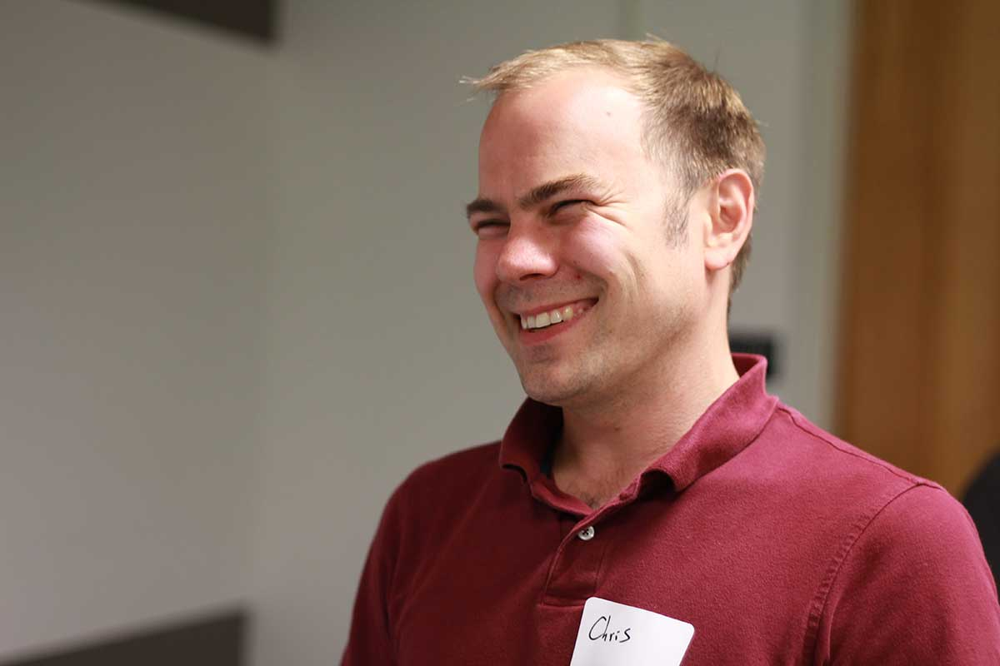

theme: Letters from Sweden, 3
autoscale: true
build-lists: true

# [fit] __*140*__ *proposals*

# [fit] *in* _**30**_ *minutes*
 
## __*Jesse Squires*__

jessesquires.com *•* @jesse_squires *•* @swiftlybrief

---

# [fit] swift __*evolution*__

> The Swift evolution process aims to leverage the collective ideas, insights, and experience of the Swift community to improve the Swift development experience.

1. *Engage community*
2. *Maintain vision and conceptual coherence*
3. *Core team responsible for strategic direction*

---
In other words...

# [fit] Turn our[^*] __*ideas*__
# [fit] Into Improvements

[^*]: *Anyone can participate!*

---

# [fit] Make __*Swift*__ Great Again

---

# [fit] Swift
# [fit] __*1.0*__ to __*3.0*__

~2 years of Swift

---

# [fit] How did we get here?

Finally, *Swift 3.0* has arrived! 😎

But *how* did that happen? 🤔

Let's *analyze* swift-evolution proposals! 🤓

^I wrote a bunch of scripts!

---

# [fit] Proposal
# [fit] metadata

# [fit] _**What can we learn?**_

---

# [fit] `"It's just metadata"`

# [fit] __*LOL*__

---

# Proposals

# [fit] __*140*__

---

# [fit] __*98*__ implemented
# [fit] __*7*__ accepted[^1]
# [fit] __*10*__ deferred
# [fit] __*19*__ Rejected
# [fit] __*3*__ Withdrawn
# [fit] 3 __*in review*__

[^1]: But not yet implemented

---

# Acceptance:
# [fit] __*75%*__
# Implementation:
# [fit] __*70%*__

---

# Swift __*1.0*__ to __*2.1*__

       
# [fit] no proposals

*#yatusabes*

*(not open source yet)*

---

# Swift __*2.2*__
# [fit] __*8*__
# Proposals implemented

---

# Swift __*3.0*__
# [fit] __*89*__
# Proposals implemented

---

# [fit] `11x` __*more*__ 😱

---

# [fit] 1012%
# [fit] __*increase*__

---

# [fit] Swift __*3.0*__

---

# Goals

---

# [fit] What actually happened?

---

   

*Swift 3:*
*Nothing compiles*

# [fit] lol

---

Swift 3 IRL:

---

# [fit] _Proposals **everywhere**_

---

# New Goals

---

# [fit] VIP's

# [fit] __*very important proposals*__

---

# Behind every proposal
# is an author

---

# Authors

# [fit] __*78*__

---

# Proposal per Author
# [fit] __*1.78*__
# `avg`

---

# Stats

- Accepted, implemented, deferred, rejected

- Acceptance rate, implementation rate, defer rate, reject rate

- avg time for review, longest, shortest

- avg # authors per proposal

- core team vs community proposals

- avg # proposals per author, top influencers?

- types of proposals: bug, syntax refinement, feature refinement, new feature

---

# Specific proposals

Most impactful

---

# Moving forward

These are (mostly) great changes that are dramatically improving the language

---

# [fit] Make __*Swift*__ Great Again

---

# What did it the cost?

---

# what did we give up?

---

# [fit] Opportunity Cost

---

- No ABI stability
- No C++ interop
- etc.

---

# What is worth it?

---

# Commonly proposed

---

# `Merci!`

---

# [fit] Resources

Swift Weekly Brief:
_swiftweekly.github.io_
_@swiftlybrief_

Apple:
_swift.org_
_github.com/apple/swift-evolution_

Me:
_jessesquires.com_
_github.com/jessesquires/swift-proposal-analyzer_
