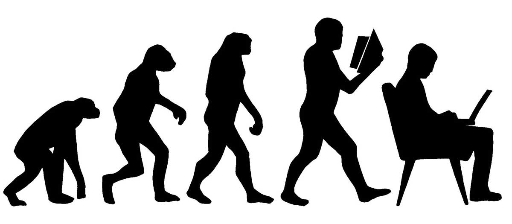
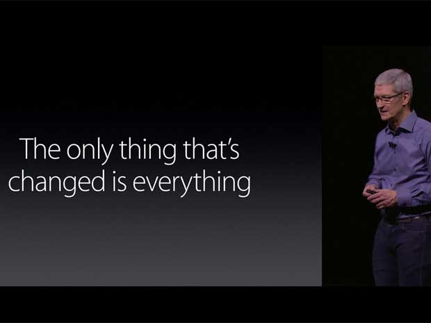

theme: Letters from Sweden, 3
autoscale: true
build-lists: true

# [fit] __*140*__ *proposals*

# [fit] *in* _**30**_ *minutes*
<br>
## __*Jesse Squires*__

jessesquires.com *•* @jesse_squires *•* @swiftlybrief

^Intro: SF, iOS at IG, Swift Weekly, JSQMessages
Talk evolved a lot while writing
Not discussing each prop, but stats + some most important

---

# [fit] swift __*evolution*__

> The Swift evolution process aims to leverage the collective ideas, insights, and experience of the Swift community to improve the Swift development experience.

1. *Engage community*
2. *Maintain vision and conceptual coherence*
3. *Core team responsible for strategic direction*

^If you aren't familiar
Swift-evo process represents openness of Swift

---
In other words...

# [fit] Turn our[^*] __*ideas*__
# [fit] Into Improvements


[^*]: *Anyone can participate!*

---

# [fit] Make __*Swift*__ Great Again


---

# [fit] Swift
# [fit] __*1.0*__ to __*3.0*__

~2 years of Swift

^It's only been 2 years! Tons of changes.

---

# [fit] How did we get here?

*Swift 3.0* has arrived! 😎

But *how* did that happen? 🤔

Let's *analyze* swift-evolution proposals! 🤓

^Originally, I wanted to discuss all proposals (kind of a lightning talk)
But, as I started writing, I had a lot of questions that I couldn't answer
So, I wrote a bunch of scripts to analyze!

---

# [fit] Proposal
# [fit] metadata

# [fit] _**What can we learn?**_

^I'll be posting a github repo with all the code
1. fetches all the proposals
2. dumps them in a playground
3. parses them -> structured data

---

# [fit] `"It's just metadata"`

# [fit] __*LOL*__


^Today, just doing some basics with metadata
But still, some interesting things!
In the future, we could do much more sophisticated analysis

---

```swift
// swift-proposal-analyzer.playground

final class Proposal {

    let title: String
    let seNumber: String    // SE-0001, SE-0002, etc.

    let authors: [Author]
    let status: Status      // .inReview, .accepted, etc.

    let fileName: String
    let fileContents: String
    let wordCount: Int
}
```

^Once fetching and parsing is complete, you end up with an array of `Proposal` structs

---

# Proposals

# [fit] __*140*__

---

# [fit] __*98*__ implemented
# [fit] __*9*__ accepted[^1]
# [fit] __*10*__ deferred
# [fit] __*19*__ Rejected
# [fit] __*3*__ Withdrawn
# [fit] 1 __*in review*__

[^1]: But not yet implemented

---

# Acceptance:
# [fit] __*76%*__
# Implementation:
# [fit] __*70%*__

---

# Word Counts
# [fit] __*1191*__ `avg`
# [fit] __*7300*__ `max`
# [fit] __*769*__ `median`
# [fit] __*167*__ `min`

^This calculation is a bit naive, not extremely precise
But, gives us a general idea for length/complexity

---

# Authors

# [fit] __*78*__

^Authors!
A lot of work to push a proposal forward
Write, discuss, revise

---
# [fit] __*100*__ one author
# [fit] __*30*__ two authors
# [fit] __*9*__ three authors
# [fit] __*1*__ nine authors
# [fit] __*1.79*__ `avg per proposal`

---

# [fit] `Top Authors`
# [fit] __*25*__ Erica Sadun
# [fit] __*13*__ Doug Gregor
# [fit] __*12*__ Joe Groff
# [fit] __*10*__ Dave Abrahams
# [fit] __*10*__ Chris Lattner

^Authors or co-authors
Erica: written as many as Doug + Joe

---

# How did each release
# evolve?



^Let's look at proposals per version

---

# Swift __*1.0*__ to __*2.1*__

<br><br><br><br><br><br><br>
# [fit] no proposals

*#yatusabes*

*(not open source yet)*


---

# Swift __*2.2*__
# [fit] __*8*__
# Proposals implemented


^Open sourced Dec 3, 2015
Released March 21, 2016
**3-4 months of dev**

---

# Swift __*3.0*__
# [fit] __*89*__
# Proposals implemented


^From March 2016 to Sept 2016
**5-6 months of dev**

---

# [fit] `11x` __*more*__ 😱

---

# [fit] 1012%
# [fit] __*increase*__


^1000% more swift
definitely 1000% more of something
1000% fewer typos lol

---

# [fit] Swift __*3.0*__

*1012% more swifty™*


^Joking, but this is kind of true
Proposals for Swift 3 really define what "swifty" means!

---

# __*Original Goals*__

- Stable ABI (Application Binary Interface)
- Resilience
- Portability
- Type system cleanup and docs
- Complete generics
- Focus and refine language
- API design guidelines

---

# [fit] What actually happened?

---

<br><br><br>

*Swift 3:*
*Nothing compiles*

# [fit] lol


---
Talking about new iPhone... or Swift 3?
`¯\_(ツ)_/¯`



^Tim Cook thought he was talking about the new iPhone but he was really talking about Swift 3

---

<br><br><br><br><br><br><br>
<br><br><br><br><br><br><br>

*__Overwhelming__ community participation!*

# [fit] _Proposals **everywhere**_


^75% of all proposals were accepted for Swift 3

---

# New Goals

- *API design guidelines*
    - Automatic application of naming guidelines to imported Objective-C APIs
    - Adoption of naming guidelines in key APIs
    - Swiftification of imported Objective-C APIs
- *Focus and refine language*
- Improvements to tooling quality

*(a.k.a Source Stability)*

^Evolution process didn't contribute to all goals
It changed them!
[goals diff](https://github.com/apple/swift-evolution/commit/06b69a6e51a71a462c268da60b51a18966dba31b)

---

# [fit] Types of proposals

- *Syntax refinements*
- *API improvements, redesigns*
- *Features (new, refined)*
- *"Bug fixes"*

---

# [fit] VIP's

# [fit] __*very important proposals*__

---

# [SE-0005](https://github.com/apple/swift-evolution/blob/master/proposals/0005-objective-c-name-translation.md)
__Better Translation of Objective-C APIs Into Swift__
*Make Cocoa/Objective-C APIs Great Again!™*

```swift
// Before
let content = text.stringByTrimmingCharactersInSet(
            NSCharacterSet.whitespaceAndNewlineCharacterSet())

// After
let content = text.trimming(.whitespaceAndNewlines)

```

^Refine how Cocoa/Objective-C APIs are imported
^Remove redundancy. Verbosity != clarity

---

# [SE-0023](https://github.com/apple/swift-evolution/blob/master/proposals/0023-api-guidelines.md)
__API Design Guidelines__ ("The Great API transformation")
*Make Swift APIs Great Again!™*

```swift
// Example:
var array = [34, 79, 12, 3, 2, 56]

// sort in-place
array.sort()

// return new, sorted array
let sorted = array.sorted()
```

---

# [SE-0025](https://github.com/apple/swift-evolution/blob/master/proposals/0025-scoped-access-level.md)
__Scoped Access Level__
*Make Access Control Specifiers Great Again!™*

```swift
// Before
public > internal > private // (to file)

// After
public > internal > fileprivate > private // (to scope)
```

---

# [SE-0117](https://github.com/apple/swift-evolution/blob/master/proposals/0117-non-public-subclassable-by-default.md)
__Allow distinguishing between public access and public overridability__
*Make Subclassing Great Again!™*

```swift
// Before
public class ViewController: UIViewController { }

// After
open class ViewController: UIViewController { }
```

---

# [fit] __*Access control in Swift 3*__

### `open`
### `public`
### `internal`
### `fileprivate`
### `private`


---

#[ SE-0069](https://github.com/apple/swift-evolution/blob/master/proposals/0069-swift-mutability-for-foundation.md)
__Mutability and Foundation Value Types__
*Make Foundation Great Again!™*

```swift
// Before
let myDate = Date()
let myLaterDate = myDate.dateByAddingTimeInterval(60)

// After
var myDate = Date()
myDate.addTimeInterval(60) // OK

let myOtherDate = Date()
myOtherDate.addTimeInterval(60) // Error (let constant)

```

^More natural use of foundation (var and let)
^Big performance increases (e.g., NSDate)

---

# [SE-0086](https://github.com/apple/swift-evolution/blob/master/proposals/0086-drop-foundation-ns.md)
__Drop NS Prefix in Swift Foundation__
*Make Prefixes Great Again!™*

```swift
// Examples:

NSDate > Date

NSURLSession > URLSession

NSCalendarUnit > Calendar.Unit

NSOperationQueuePriority > Operation.QueuePriority
```

^Rename types, hoisted types

---

# [SE-0065](https://github.com/apple/swift-evolution/blob/master/proposals/0065-collections-move-indices.md)
__A New Model for Collections and Indices__
*Make Collection Indices Great Again!™*

```swift
var index = c.index(where: { /* condition */ })

// Before
index.successor()

// After
collection.index(after: index)
```

^complete rewrite
^index traversal moved from index to collection
^huge perf benefits (index doesn't have to know about collection)
^big impact if you have custom collections

---

# TODO:

select a couple more proposals to discuss?

- SE-0072, Fully eliminate implicit bridging conversions from Swift

- SE-0062, Referencing Objective-C key-paths
- SE-0064, Referencing the Objective-C selector of property getters and setters

---

# [fit] The cost of Swift Evolution

<br>


---

# [fit] __*Opportunity*__
# [fit] __*Cost*__
# [fit] what did we give up?

^Most of Swift 3's original goals!
^ABI, generics
^First OSS release, novelty effect, necessary evil
^But source stability is extremely important

---

# [fit] __*Was it worth it?*__

# [fit] `Source stability >> ABI stability`

^Always trades-offs
^I think source stability is far more important (at least initially)
^However, some proposals were distracting

---

# `Merci!`


---

# [fit] Resources

Me:
_jessesquires.com_
_github.com/jessesquires/swift-proposal-analyzer_

Swift Weekly Brief:
_swiftweekly.github.io_
_@swiftlybrief_

Apple:
_swift.org_
_github.com/apple/swift-evolution_
