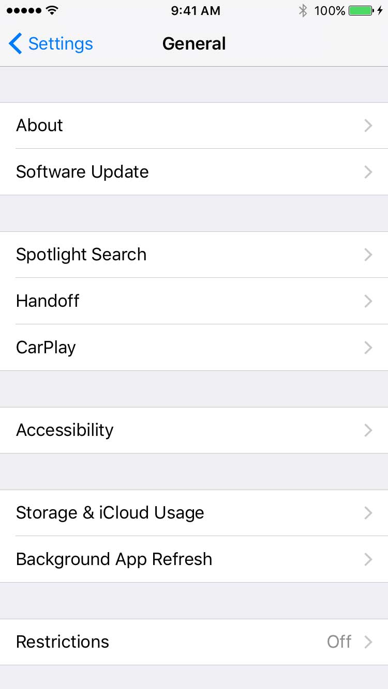

theme: Letters From Sweden, 5
autoscale: true
build-lists: true
slidenumbers: false

# [fit] Pushing the limits of
# [fit] protocol-oriented
# [fit] programming
<br>
# Jesse Squires

*jessesquires.com* • *@jesse_squires*

^Hopefully you saw Nate's talk on protocols yesterday
- Great example of how protocols and open up your code to be more flexible
-Program against protocol, not specific type
- Today, diving further into these ideas

---

# [fit] The __*Swift*__ way

How do we write swifty code?

Standard library:

"Protocols and value types all the way down."

^- Every language has a personality
- Like ObjC, Swift has a distinct personality
- Swift personality expressed in std lib
- ObjC personality expressed in Foundation

---

# [fit] Writing __*"Swifty"*__ code
# [fit] means writing __*protocol-oriented*__ code


---

# [fit] What is
# [fit] __*protocol-oriented*__
# [fit] programming?

^- I have no idea, but it sounds cool
- What do we really mean?
- Nate gave great examples
- Not a new idea!
- Old concept!

---

# [fit] SOLID
# [fit] Design Principles

^Who's heard of solid?
- Set of principles for designing "good" software modules
- clean code
- Guidelines to make code modular and easy to change, reduce debt
- Paul's talk on the Visitor Pattern with Storyboards

---

# [fit] SOL__*I*__D
# [fit] __*Interface Segregation*__

---

# [fit] "Protocol-oriented"
# [fit] __*Interface Segregation*__

^POP embodies this principle
POP means implementing the interface segregation principle

---

# Wat?

What do we mean by
"interface segregation"?


---

# Protocols

The "I" in SOLID:
*No client should depend on (or know about) methods it does not use.*

- Small, separated interfaces == focused API
- Restrict access
- Unify disjoint types
- Hide concrete types
- Flexibility

^- think breaking up tableViewDelegate
- only access what's in the protocol
- treat different types the same way (no common ancestor)
- encapsulate the actual type

---

# Why?

> Why do we want to use protocols?

— Greg Heo


^- More abstract
- Potential to introduce more complexity (expressions)

---

# __*Protocols*__
# __*help us write*__
# __*code that is:*__

1. modular
2. dynamic
3. testable


^- Modular: underlying types can change, consumers don't
- Very helpful for refactoring (Ben's talk)
- Like Paul's talk: changing the storyboard, but not the code
- Dynamic: any type, resolved at runtime, extensions with constraints
- Testable: easy to mock/fake

---

# [fit] What if everything
# [fit] were a `protocol`?

*(well, almost)*

Let's find out!


^- lots of benefits
- let's take advantage of them

---

# __*Experiment:*__
# Let's build
# protocol-oriented
# data sources

— `UITableViewDataSource`
— `UICollectionViewDataSource`

*Table views and collection views are fundamental components of most apps.*

^- An exercise to see what we can learn!
- Lot's of code
- Very simplified snippets
- Omitting details to focus on ideas
- Keep slides readable/understandable

---

# Goals

1. *protocol-based*
2. *type-safe* / generic
3. __*unify*__ `UITableView` and `UICollectionView`
4. *remove UIKit boilerplate*
5. *avoid* `NSObject` and `NSObjectProtocol` ("pure" Swift)

^- tables and collections are just barely different enough
- not interchangeable
- makes you angry

---




---

# Responsibilities

*Display data in a list or grid.*

What do we need?

1. Structured data (sections with items/rows)
2. Create and configure cells
3. Conform to UITableViewDataSource
4. Conform to UICollectionViewDataSource

---

# Section __*Protocol*__

```swift
protocol SectionInfoProtocol {
    associatedtype Item

    var items: [Item] { get set }

    var headerTitle: String? { get }

    var footerTitle: String? { get }
}
```

---

# Section __*Type*__

```swift
struct Section<Item>: SectionInfoProtocol {

    var items: [Item]

    let headerTitle: String?

    let footerTitle: String?
}
```

---

# DataSource __*Protocol*__

```swift
protocol DataSourceProtocol {
    associatedtype Item

    func numberOfSections() -> Int

    func numberOfItems(inSection section: Int) -> Int

    func item(atRow row: Int, inSection section: Int) -> Item?

    func headerTitle(inSection section: Int) -> String?

    func footerTitle(inSection section: Int) -> String?
}
```

^Note: this is basically what UICollectionView and UITableView data sources ask for

---

# DataSource __*Type*__

```swift
struct DataSource<S: SectionInfoProtocol>: DataSourceProtocol {

    var sections: [S]

    // MARK: DataSourceProtocol

    func numberOfSections() -> Int {
        return sections.count
    }

    // other protocol methods...
}
```

---

# Responsibilities

✅ Structured data
__2. Create and configure cells__
3. Conform to UITableViewDataSource
4. Conform to UICollectionViewDataSource

---

# Create + configure cells

1) We need a common interface (protocol) for:

— *Tables & collections*
— *Table cells*
— *Collection cells*

2) We need a __unified__ way to create + configure cells

^- These are all different classes
- No common superclass with the functionality we need
(UIView doesn't work)

---

# Unify tables + collections

```swift
// UITableView
// UICollectionView

protocol CellParentViewProtocol {
    associatedtype CellType: UIView

    func dequeueReusableCellFor(identifier: String,
                                indexPath: IndexPath) -> CellType
}
```

^Both tables and collections need to dequeue cells

---

# Unify tables + collections

```swift
// conform collection view
// (table view is similar)

extension UICollectionView: CellParentViewProtocol {
    typealias CellType = UICollectionViewCell

    func dequeueReusableCellFor(identifier: String,
                                indexPath: IndexPath) -> CellType {
        return dequeueReusableCell(withReuseIdentifier: identifier,
                                   for: indexPath)
    }
}
```

^- Specify collection cell type
- Wrap collection dequeue method
- Same for table view

---

# Unify cells

```swift
// UITableViewCell
// UICollectionViewCell

protocol ReusableViewProtocol {
    associatedtype ParentView: UIView, CellParentViewProtocol

    var reuseIdentifier: String? { get }

    func prepareForReuse()
}
```

^- reusable cells know their parent view
- other standard methods

---

# Unify cells

```swift
extension UICollectionViewCell: ReusableViewProtocol {
    typealias ParentView = UICollectionView
}

extension UITableViewCell: ReusableViewProtocol {
    typealias ParentView = UITableView
}

// already implemented in UIKit
//
// var reuseIdentifier: String? { get }
// func prepareForReuse()
```

^- only need to specify the parent view

---

# [fit] __*Sharing a common interface*__

<br>

__CellParentViewProtocol__

- UITableView and UICollectionView

<br>

__ReusableViewProtocol__

- UITableViewCell and UICollectionViewCell


---

# Create + configure cells

✅ A common interface
__2. A unified way to create and configure cells__

^- Now we can speak to these different classes as if they were the same

---

# [fit] Configure cells __*Protocol*__

```swift
// configure a cell with a model

protocol ReusableViewConfigProtocol {
    associatedtype Item
    associatedtype View: ReusableViewProtocol

    func reuseIdentiferFor(item: Item?,
                           indexPath: IndexPath) -> String

    func configure(view: View,
                   item: Item?,
                   parentView: View.ParentView,
                   indexPath: IndexPath) -> View
}
```

^- all we need to do is specify how to configure a cell for a given model
- Item = data model backing the view
- View = table cell or collection cell

---

# [fit] Create cells __*extension*__

```swift
// for table view, similar for collection view
extension ReusableViewConfigProtocol where View: UITableViewCell {
    func tableCellFor(item: Item,
                      tableView: UITableView,
                      indexPath: IndexPath) -> View {

        let cellId = self.reuseIdentiferFor(item: item, indexPath: indexPath)

        // CellParentViewProtocol
        let cell = tableView.dequeueReusableCellFor(identifier: cellId,
                                                    indexPath: indexPath) as! View

        return self.configure(view: cell,
                              item: item,
                              parentView: tableView,
                              indexPath: indexPath)
    }
}
```

^- Protocol only specifies how to configure
- Extension defines how to create
- Free!
- Only available when configuring table cells!
- Same with collections

---

# Create + configure cells __*Type*__

```swift
struct ViewConfig<Item, Cell: ReusableViewProtocol>: ReusableViewConfigProtocol  {
    let reuseId: String
    let configClosure: (Cell, Item, Cell.ParentView, IndexPath) -> Cell

    // ReusableViewConfigProtocol

    func reuseIdentiferFor(item: Item?,
                           indexPath: IndexPath) -> String {
        return reuseId
    }

    func configure(view: View,
                   item: Item?,
                   parentView: View.ParentView,
                   indexPath: IndexPath) -> View {
        return configClosure(view, item, parentView, indexPath)
    }
}
```

^-Specific type in create cells
- 1st function just returns reuse id
- 2nd function returns result of the closure

---

# Responsibilities

✅ Structured data
✅ Create and configure cells
__3. Conform to UITableViewDataSource__
__4. Conform to UICollectionViewDataSource__


---

# Data source protocols

```swift
class BridgedDataSource: NSObject,
                         UICollectionViewDataSource,
                         UITableViewDataSource {

    // Init with closures for each data source method

    // Implement UICollectionViewDataSource

    // Implement UITableViewDataSource
}
```

---

# [fit] Data source protocols __*Example*__

```swift
class BridgedDataSource: NSObject {

    let numberOfSections: () -> Int

    // other closure properties...
}

extension BridgedDataSource: UICollectionViewDataSource {

    func numberOfSections(in collectionView: UICollectionView) -> Int {
        return self.numberOfSections()
    }

    // other data source methods...
}
```

---

# Responsibilities

<br><br>

✅ Structured data
✅ Create and configure cells
✅ UITableViewDataSource
✅ UICollectionViewDataSource


---

# [fit] Everything we need

```swift
protocol SectionInfoProtocol { } // sections of items

protocol DataSourceProtocol { } // full data source

protocol CellParentViewProtocol { } // tables + collections

protocol ReusableViewProtocol { } // cells

protocol ReusableViewConfigProtocol { } // configure cells

class BridgedDataSource { } // UIKit data sources
```

---

# Connecting the pieces

```swift
class DataSourceProvider<D: DataSourceProtocol,
                         C: ReusableViewConfigProtocol>
      where D.Item == C.Item {

    var dataSource: D
    let cellConfig: C

    private var bridgedDataSource: BridgedDataSource?

    init(dataSource: D, cellConfig: C)
}
```

---

# Results

```swift
let data = DataSource(sections: /* sections of models */)

let config = ViewConfig(reuseId: "cellId") { (cell, model, view, indexPath) -> MyCell in
    // configure cell with model
    return cell
}

let provider = DataSourceProvider(dataSource: data, cellConfig: config)

// connect to collection
collectionView.dataSource = provider.collectionViewDataSource

// connect to table
tableView.dataSource = provider.tableViewDataSource
```

^- pass in our data
- pass in our cell config
- give me a data source for this collection
- give me a data source for this table

---

# [fit] How does that work?


```swift
// Collections
provider.collectionViewDataSource

// Tables
provider.tableViewDataSource
```

---

# Generating specific data sources

```swift
// class DataSourceProvider<D,C>
// private var bridgedDataSource: BridgedDataSource?

extension DataSourceProvider where C.View: UITableViewCell {

    public var tableViewDataSource: UITableViewDataSource {
        // create and return new BridgedDataSource
        // using self.dataSource and self.cellConfig
    }

    private func createTableViewDataSource() -> BridgedDataSource {
        // ...
    }
}
```

---

# Generating specific data sources

```swift
// extension DataSourceProvider where C.View: UITableViewCell
func createTableViewDataSource() -> BridgedDataSource {
    let source = BridgedDataSource()

    source.numberOfSections = { () -> Int in
        return self.dataSource.numberOfSections()
    }

    source.numberOfItemsInSection = { (section) -> Int in
        return self.dataSource.numberOfItems(inSection: section)
    }

    source.tableCellForRowAtIndexPath = { (tableView, indexPath) -> UITableViewCell in
        let item = self.dataSource.item(at: indexPath)
        // extension method on ReusableViewConfigProtocol
        return self.cellConfig.tableCellFor(item: item,
                                            tableView: tableView,
                                            indexPath: indexPath)
    }
}
```

^- Collection view follows similarly

---

# Results — One more time

```swift
let data = DataSource(sections: /* sections of models */)

let config = ViewConfig(reuseId: "cellId") { (cell, model, view, indexPath) -> MyCell in
    // configure cell with model
    return cell
}

let provider = DataSourceProvider(dataSource: data, cellConfig: config)

// connect to collection
collectionView.dataSource = provider.collectionViewDataSource

// connect to table
tableView.dataSource = provider.tableViewDataSource
```

^- So simple, beautiful
- Declarative: define data, define cell config
- Input these, get back UIKit data source
- Compiler can enforce everything!

---

# Summary

Protocols are much more powerful in Swift than in Objective-C. 💪


^- This is crazy! Kind of dense.
- Remember! Pushing the limits here
- Yes, we've introduce a lot of complexity here
- But! Complexity is encapsulated
- Now the compiler can verify everything. do the heavy lifting, catch bugs

---

# __*Protocol Extensions*__
# Dynamic interface segregation

```swift
extension ReusableViewConfigProtocol where View: UITableViewCell {
    func tableCellFor(item: Item,
                      tableView: UITableView,
                      indexPath: IndexPath) -> View
}

extension DataSourceProvider where C.View: UITableViewCell {
    var tableViewDataSource: UITableViewDataSource
}
```

You __cannot__ access *tableViewDataSource* if you are creating *UICollectionViewCells*!

^- Even though you conform to this protocol, this functionality is mutually exclusive
- If you configure a collection cell, it is impossible to create a table cell
- Enforced by compiler!

---

# __*Protocols*__
# Restrict access

```swift
// class DataSourceProvider<D,C>
var tableViewDataSource: UITableViewDataSource
```

Returns __BridgedDataSource__ but clients don't know!

(It also conforms to UICollectionViewDataSource)


---

# __*Protocols*__
# Unify disjoint types
# Hide types

```swift
protocol CellParentViewProtocol { }

protocol ReusableViewProtocol { }
```

We can treat tables, collections and their cells the same way — speaking to the same interface.


---

#__*Protocols*__
# Modular

```swift
protocol SectionInfoProtocol { }

protocol DataSourceProtocol { }

protocol ReusableViewConfigProtocol { }
```

*Anything can be a data source*

*Anything can configure cells*


---

# __*Protocols*__
# Testable

Easy to "mock" or fake
a __protocol__ in a unit test.

Easy to verify that
a __protocol__ method was called.


^- Verify with XCTestExpectations

---

# [fit] Protocols + Extensions
# [fit] __*expand our*__
# [fit] design space

^- can express things that were impossible in ObjC
- define minimum functionality in protocol
- get tons of rich behavior for free in extensions

---

# [fit] Thanks!

*Me:*
@jesse_squires
jessesquires.com

*Swift Weekly Brief:*
@swiftlybrief
swiftweekly.github.io
