theme: Titillium, 1
autoscale: true
build-lists: false
slidenumbers: false

# [fit] **Exploring Swift's**
# [fit] numeric **types**
# [fit] **and protocols**

ints, floats, and doubles — oh my!

**Jesse Squires**
*jessesquires.com* • *@jesse_squires*


^This talk is mostly about floating-point precision,
but we'll see how Swift lets us explore them

---

# [fit] **Numbers**

# [fit] _**How do they work?**_

<br><br><br><br>


^I've got ~100 slides and only 30 minutes.
We're about to find out!
We can describe the natural world with the language of mathematics, but this is more difficult in computing

---

# [fit] **Fundamental to computing**

_**Computers used to be giant calculators**_

ENIAC *(Electronic Numerical Integrator and Computer)*

✅ **For large computations**

❌ **Not for flappy bird**


^One of the earliest general purpose computers
Used to be the size of a room, now condensed into Calculator.app -- everyone's favorite app!

---

# **Swift's numeric types**

*Floating-point*

```swift
Float, Double, Float80
```

*Integers*

```swift
Int // platform native word size
Int8, Int16, Int32, Int64
```

*Unsigned Integers*

```swift
UInt // platform native word size
UInt8, UInt16, UInt32, UInt64
```

^We have 3 main categories for our concrete types
Each specifies its size (some explicit, some implicit)
`Int` and `UInt` are "special" - current platform native word size, 32 on 32, 64 on 64
There are typealiases for Float32 and Float64

---

# [fit] **Why so many types?** _(sizes)_

- Different processor architectures

- Inter-op with C
(C functions, `char *[]` imported as `Int8` tuple)

- Inter-op with Objective-C
(`BOOL` is a `typedef char`)

- SQLite / CoreData

- IoT sensors (heart rate monitor)

- Embedded systems programming


---

# [fit] **Before Swift**
# [fit] **3 and 4**

- Difficult to work with numeric types
- Difficult to extend numeric types
- `FloatingPoint` did not have all IEEE 754 features
- Generally rough around the edges


---

## **Swift 2**

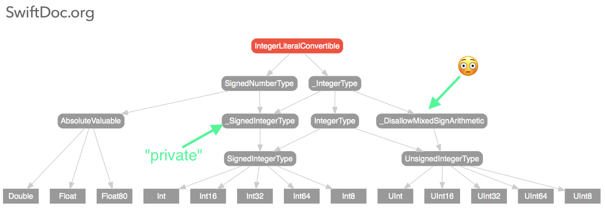

^There was also a `BitwiseOperationsType`

---

## **Swift**
## **2**

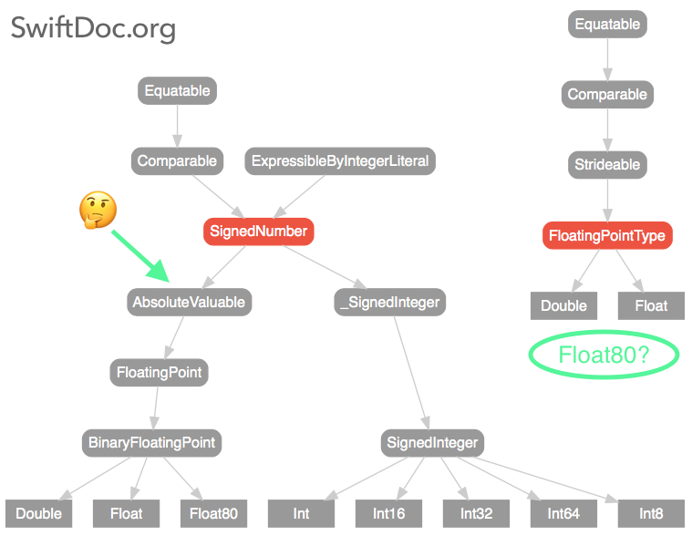

---


---

# **Swift evolution**

[SE-0104](https://github.com/apple/swift-evolution/blob/master/proposals/0104-improved-integers.md): *Protocol-oriented integers* **(Swift 4)**

[SE-0113](https://github.com/apple/swift-evolution/blob/master/proposals/0113-rounding-functions-on-floatingpoint.md): *Add integral rounding functions to FloatingPoint* **(Swift 3)**

[SE-0067](https://github.com/apple/swift-evolution/blob/master/proposals/0067-floating-point-protocols.md): *Enhanced Floating Point Protocols* **(Swift 3)**

- Address API shortcomings
- Refine protocol naming and contents
- Refine protocol hierarchy


---

## Numeric
## Protocols

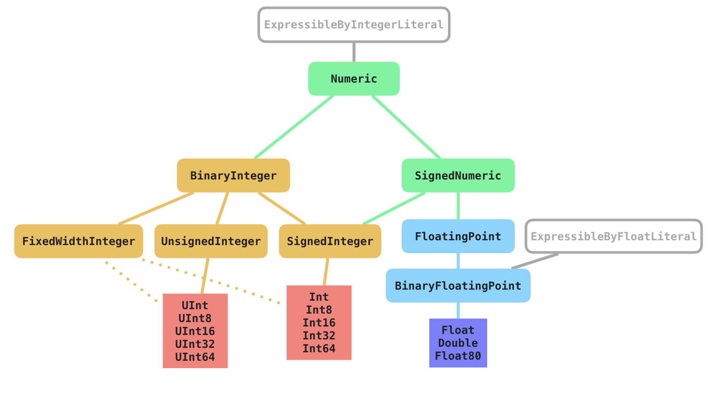

^Unify these numeric types, give common interface

---

# **[`protocol Numeric`](https://developer.apple.com/documentation/swift/numeric)**

Binary arithmetic operators `+`, `-`, `*`

```swift
extension Sequence where Element: Numeric {
    func sum() -> Element {
        return reduce(0, +)
    }
}

let sum = [1, 2, 3, 4, 5].sum() // 15
```

---

# **[`protocol SignedNumeric`](https://developer.apple.com/documentation/swift/signednumeric)**

Types that can represent both positive and negative values (**not** `UInt`)

```swift
var i = 5; i.negate() // -5

extension Sequence where Element: SignedNumeric & Comparable {
    func filterNegatives() -> [Element] {
        return filter { $0 > 0 }
    }
}

let allPositive = [1, 2, 3, -4, -5].filterNegatives() // [1, 2, 3]
```

---

# **[`protocol BinaryInteger`](https://developer.apple.com/documentation/swift/binaryinteger)**

Basis for all the integer types provided by the standard library

Arithmetic, bitwise, and bit shifting operators `/`, `<<`, `&`, etc

```swift
// Convert between integer types
let x = Int16(exactly: 500) // Optional(500)
let y = Int8(exactly: 500) // nil

// Truncating - make 'q' to fit in 8 bits
let q: Int16 = 850 // 0b00000011_01010010
let r = Int8(truncatingIfNeeded: q) // 82, 0b01010010

// Compare across types
Int(-42) < Int8(4)       // true
UInt(1_000) < Int16(250) // false
```

^All kind of conversion APIs, including unsafe ones

---

# [fit] **[`protocol FixedWidthInteger`](https://developer.apple.com/documentation/swift/fixedwidthinteger)**

*Endianness*, type bounds, bit width

```swift
let x = Int16(127) // 127
x.littleEndian     // 127,   0b00000000_01111111
x.bigEndian        // 32512, 0b01111111_00000000
x.byteSwapped      // 32512, 0b01111111_00000000


Int16.bitWidth // 16
Int16.min      // -32768
Int16.max      // 32768
```

^Endianness: sequential order in which bytes are arranged

---

```swift
extension FixedWidthInteger {
    var binaryString: String {
        var result: [String] = []
        for i in 0..<(Self.bitWidth / 8) {
            let byte = UInt8(truncatingIfNeeded: self >> (i * 8))
            let byteString = String(byte, radix: 2)
            let padding = String(repeating: "0",
                                 count: 8 - byteString.count)
            result.append(padding + byteString)
        }
        return "0b" + result.reversed().joined(separator: "_")
    }
}

let x = Int16(4323)
x.binaryString // 0b00010000_11100011
```

---

# **[`protocol FloatingPoint`](https://developer.apple.com/documentation/swift/floatingpoint)**

Represents fractional numbers, [*IEEE 754 specification*](http://ieeexplore.ieee.org/document/4610935/)

```swift
func hypotenuse<T: FloatingPoint>(_ a: T, _ b: T) -> T {
    return (a * a + b * b).squareRoot()
}

let (dx, dy) = (3.0, 4.0)
let dist = hypotenuse(dx, dy) // 5.0
```

---

# **[`protocol FloatingPoint`](https://developer.apple.com/documentation/swift/floatingpoint)**

Provides common constants

Precision is that of the concrete type!

```swift
static var leastNormalMagnitude: Self    // FLT_MIN or DBL_MIN

static var greatestFiniteMagnitude: Self // FLT_MAX or DBL_MAX

static var pi: Self // 🍰 😋
```

^You can have Float pi or Double pi

---

# [fit] **[`protocol BinaryFloatingPoint`](https://developer.apple.com/documentation/swift/binaryfloatingpoint)**

Specific radix-2 (binary) floating-point type

In the future, there could be a `DecimalFloatingPoint` protocol for decimal types (radix-10)

You could create your own!
(radix-8, `OctalFloatingPoint` protocol)

---

# **Protocols** are not just *bags of syntax* [^*]

# **Protocols** have *semantics*


[^*]: [*Protocols are more than Bags of Syntax*](https://oleb.net/blog/2016/12/protocols-have-semantics/), Ole Begemann

---

## Semantics


---

# [fit] **"Protocol-oriented" numerics**

# But we still need to work with *concrete types*

<br>

```swift
Float, Double, Float80
Int, Int8, Int16, Int32, Int64
UInt, UInt8, UInt16, UInt32, UInt64
```

^Protocols let us write generic functions or more general code
But still, they sometimes breakdown when mixing types

---

# Mixing numeric types: 😭

```swift
// ⚠️ Binary operator '+' cannot be applied to
// operands of type 'Double' and 'Int'
let x = 42
let y = 3.14 + x

// ⚠️ Binary operator '+' cannot be applied to
// operands of type 'Float' and 'Double'
let f = Float(1.0) + Double(2.0)

// ✅ works
let z = 3.14 + 42
```

^This is because these numbers are different sizes and representations in memory.
No way for Swift to "know" what to do and guarantee safety

---

# Type inference: ☺️

```swift, [.highlight: 9-11]
// Binary operator '+' cannot be applied to
// operands of type 'Double' and 'Int'
let x = 42
let y = 3.14 + x

// Binary operator '+' cannot be applied to
// operands of type 'Float' and 'Double'
let f = Float(1.0) + Double(2.0)

// 42 inferred as 'Double', ExpressibleByIntegerLiteral
let z = 3.14 + 42
```

---

# Previous example:

```swift
extension Sequence where Element: SignedNumeric & Comparable {
    func filterNegatives() -> [Element] {
        return filter { $0 > 0 }
    }
}

// mixing types
let allPositive = [UInt(1), 2.5, 3, Int8(-4), -5].filterNegatives()

// ⚠️ error: type of expression is ambiguous without more context
```

---

# Previous example:

```swift
func hypotenuse<T: FloatingPoint>(_ a: T, _ b: T) -> T {
    return (a * a + b * b).squareRoot()
}

// mixing types
let (dx, dy) = (Double(3.0), Float(4.0))
let dist = hypotenuse(dx, dy)

// ⚠️ error: cannot convert value of type
// 'Float' to expected argument type 'Double'
```

---

<br>
# [fit] Sad. 😭

---

# But, this

```swift
func hypotenuse<T: FloatingPoint>(_ a: T, _ b: T) -> T
```

# Is better than this

```swift
func hypotenuse(_ a: Float, _ b: Float) -> Float
func hypotenuse(_ a: Double, _ b: Double) -> Double
func hypotenuse(_ a: Float80, _ b: Float80) -> Float80
func hypotenuse(_ a: CGFloat, _ b: CGFloat) -> CGFloat

```

---


<br>
# [fit] Less sad. ☺️

---

## Concrete types:
# **How many** bits **do you need?**

1. Prefer `Int` for integer types, even if nonnegative
2. Prefer `Double` for floating-point types
3. *Exceptions: C functions, SQLite, etc.*

## **Why?**

Type inference, reduce or avoid casting


^Why not have Int and Double?
Consistency, interoperability

---


# Making our raw
# calculation
# `code` more
# [fit] **expressive**


---

# [fit] Example: **drawing line graphs** 📈

```swift
let p1 = Point(x1, y1)
let p2 = Point(x2, y2)
let slope = p1.slopeTo(p2)

```

*Need to check if the slope is:*

- undefined (vertical line)
- zero (horizontal line)
- positive
- negative

---

# [fit] Extensions for our __specific domain__

```swift
extension FloatingPoint {
    var isUndefined: Bool { return isNaN }
}

extension SignedNumeric where Self: Comparable {
    var isPositive: Bool { return self > 0 }

    var isNegative: Bool { return self < 0 }
}
```

---

# [fit] Example: **drawing line graphs** 📈

```swift
if slope.isZero {

} else if slope.isUndefined {

} else if slope.isPositive {

} else if slope.isNegative {

}

```

*This code reads like a sentence.*

^No comments needed!

---

# **small** tweaks make a
# [fit] **BIG**
# difference in **readability**
<br>

---

# Like most types in the Standard Library, the numeric types are **`structs`**

Primitive values with *value semantics*, but also "object-oriented"

^They're "just numbers" but being structs makes them so much more powerful

---

# [fit] **Let's go**
# [fit] one more
# [fit] **level down**

# — Greg Heo


---

## [fit] How are they implemented?
# [fit] **`github.com/apple/swift`**
# **`stdlib/public/core/`**

- Structs with private `_value` property (`Builtin` type)
- Conform to `ExpressibleBy*Literal`

---

# **Swift compiler**
# LLVM architecture

A brief overview

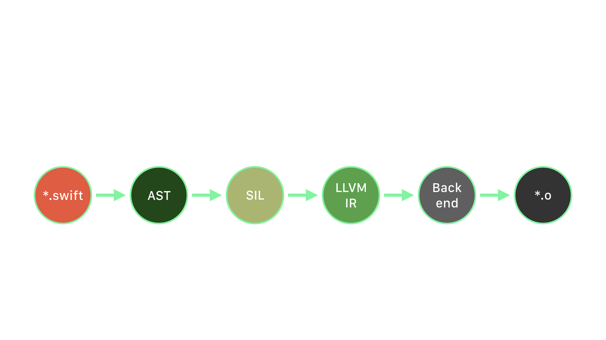

---

```swift
struct Int64 {
    var _value: Builtin.Int64

    init(_builtinIntegerLiteral x: _MaxBuiltinIntegerType) {
        _value = Builtin.s_to_s_checked_trunc_Int2048_Int64(x).0
    }
}

struct UInt8 {
    var _value: Builtin.Int8

    init(_builtinIntegerLiteral x: _MaxBuiltinIntegerType) {
        _value = Builtin.s_to_u_checked_trunc_Int2048_Int8(x).0
    }
}
```

---

```swift
struct Float {
    var _value: Builtin.FPIEEE32

    init(_bits v: Builtin.FPIEEE32) {
        self._value = v
    }

    init(_builtinIntegerLiteral value: Builtin.Int2048){
        self = Float(_bits: Builtin.itofp_with_overflow_Int2048_FPIEEE32(value))
    }

    init(_builtinFloatLiteral value: Builtin.FPIEEE64) {
        self = Float(_bits: Builtin.fptrunc_FPIEEE64_FPIEEE32(value))
    }
}
```

^Builtin types access LLVM primitives

---

Constructing `Int64` from a `Double`

```swift
struct Int64 {

    init(_ source: Double) {
        _precondition(source.isFinite,
        "Double value cannot be converted to Int64 because it is either infinite or NaN")

        _precondition(source > -9223372036854777856.0,
        "Double value cannot be converted to Int64 because the result would be less than Int64.min")

        _precondition(source < 9223372036854775808.0,
        "Double value cannot be converted to Int64 because the result would be greater than Int64.max")

        self._value = Builtin.fptosi_FPIEEE64_Int64(source._value)
    }
}
```

Preventing underflow / overflow!

---

# [fit] Swift is a
# [fit] **memory-safe**
# [fit] language 🤓

---

# [fit] Swift **guarantees** 💪

- Type safety
- Boundaries of numeric types
- Traps overflow / underflow behavior and reports an error

---

## ❌ `fatal errors`

```swift
// ⚠️ fatal error: Not enough bits to represent a signed value
let i = Int8(128)

// ⚠️ fatal error: Negative value is not representable
let i = UInt(-1)

// ⚠️ fatal error: Double value cannot be converted
// to Int because the result would be greater than Int.max
let i = Int(Double.greatestFiniteMagnitude)
```

^Again, this is because these numbers are different sizes in memory!
No way for Swift to "know" what to do and guarantee safety

---

# 🤔 **not** `fatal error`

```swift
// ⚠️ inf
let f = Float32(Float80.greatestFiniteMagnitude)

// f == Float32.infinity
```

^only `_precondition` checks in `FloatingPointTypes` are for constructing `NaN`

---

# **Quiz** 🤓

What is the value of sum?

```swift
// Add 0.1 ten times
let f = Float(0.1)
var sum = Float(0.0)
for _ in 0..<10 {
    sum += f
}
```

---

# **Quiz** 🤓

What is the value of sum?

# [fit] `1.0` **?**

---

# Nope
# 😐


---

# **Quiz** 🤓

What is the value of sum?

# [fit] `1.00000011920928955078125`

Floating-point math is not exact!

^Every value is rounded. We start with a rounded, then add it ten times with potential rounding at each add

---

# [fit] **Let's go**
# [fit] one more
# [fit] **level down**
# [fit] *again*

# — Greg Heo


---

# [fit] Floating-point
# [fit] **precision**


---

# But first,
# [fit] **memory layout**


---

# Integer representation

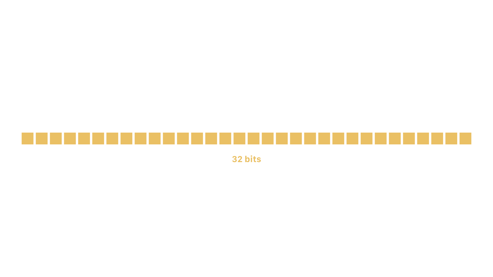

---

# Integers: just bits[^**]


[^**]: Signed integers are typically represented in two’s complement, but that’s an implementation detail.

---

# [fit] Floating-point representation

## **4 elements:**

- **Sign:** negative or positive
- **Radix (or Base):** 2 for binary, 10 for decimal, ...
- **Significand:** series of digits of the base
The number of digits == precision
- **Exponent:**  represents the offset of the significand (biased)

`value = significand * radix ^ exponent`

^http://www.cplusplus.com/reference/cfloat/

---

```swift
protocol FloatingPoint {
    var sign: FloatingPointSign { get }

    static var radix: Int { get }

    var significand: Self { get }

    var exponent: Self.Exponent { get }
}

// Float, Double, Float80
```

---

# [fit] Floating-point: **not "just bits"**

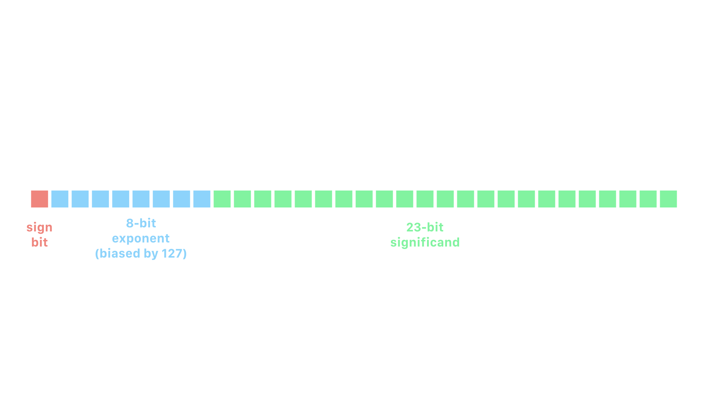

^exponent biased by 127. makes it easier to store signed values.
implicit offset. subtract bias to get actual value.

---

# [fit] Floating-point representation

`Float.pi`
🍰

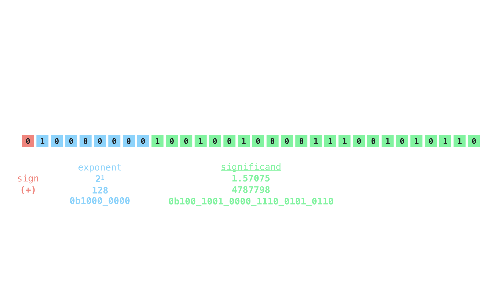

^Note: biased exponent `128 - 127 = 1`

---

```swift
let pi = 3.1415
pi.sign         // plus
pi.exponent     // 1
pi.significand  // 1.57075

// 1.57075 * 2.0^1 = 3.1415
Float(pi.significand) * powf(Float(Float.radix), Float(pi.exponent))
```

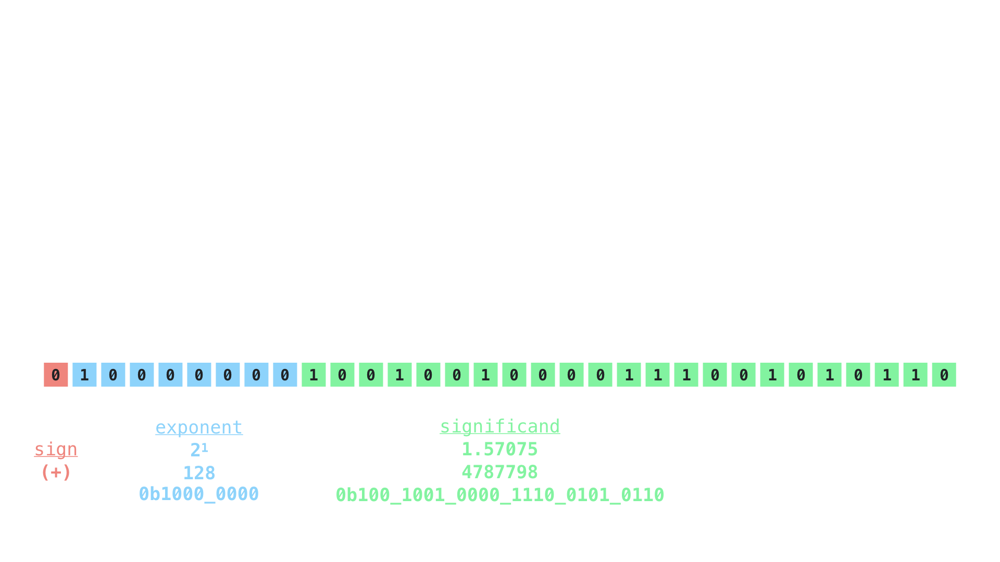

---

```swift
protocol BinaryFloatingPoint {
    var exponentBitPattern: Self.RawExponent { get }

    var significandBitPattern: Self.RawSignificand { get }

    static var exponentBitCount: Int { get }

    static var significandBitCount: Int { get }
}

// Float, Double, Float80
```

---

```swift
pi.sign                     // plus
pi.exponentBitPattern       // 128
pi.significandBitPattern    // 4787798

Float.exponentBitCount      // 8 bits
Float.significandBitCount   // 23 bits
```


---

<br><br><br><br><br><br><br><br><br>

# **Interesting properties**
# of floating-point values


---

# Positive and negative zero

Implementation

```swift
// FloatingPointTypes.swift
public var isZero: Bool {
    return exponentBitPattern == 0 && significandBitPattern == 0
}
```

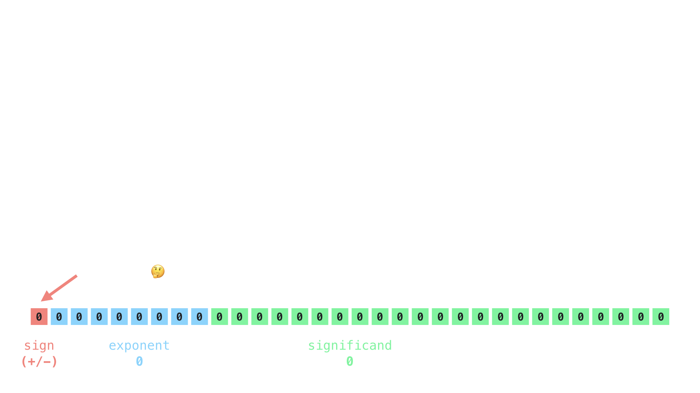

^No such thing as +/-0 in real world

---

# NaN != NaN

Implementation

```swift
// FloatingPointTypes.swift
public var isNaN:  Bool {
    // isFinite == exponentBitPattern < Float._infinityExponent
    return !isFinite && significandBitPattern != 0
}
```

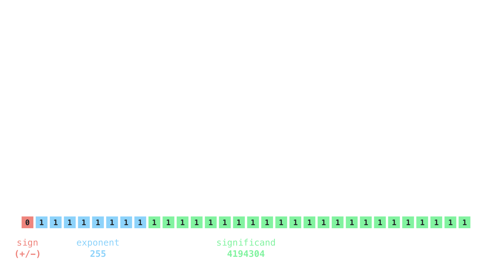

^NaN is unordered: it is not equal to, greater than, or less than anything, including itself

---

# ± Infinity

```swift
static var infinity: Float {
    // FloatingPointTypes.swift
    return Float(sign: .plus,
                 exponentBitPattern: _infinityExponent,
                 significandBitPattern: 0)
}
```

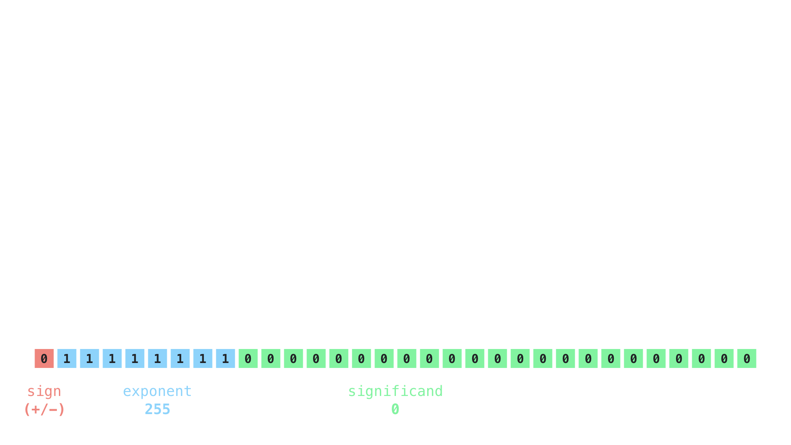

---

## **Now, back to...**

# [fit] Floating-point
# [fit] **precision**


---

# Floating-point values are **imprecise** due to **rounding**


---

# How do we measure rounding error?

```swift
// Swift 4
// ⚠️ 'FLT_EPSILON' is deprecated:
// Please use 'Float.ulpOfOne' or '.ulpOfOne'.
FLT_EPSILON

protocol FloatingPoint {
    static var ulpOfOne: Self { get }
}
```

---

<br>
# [fit] `.ulpOfOne`? 🤢

---

# **Documentation**

`ulpOfOne`

The unit in the last place of 1.0.

---

<br>
# [fit] Wat 😐

---

# **Documentation**

**Discussion**

The positive difference between `1.0` and the next greater representable number. The `ulpOfOne` constant corresponds to the C macros `FLT_EPSILON`, `DBL_EPSILON`, and others with a similar purpose.

---

# [fit] **Machine epsilson:** ISO C Standard

`protocol FloatingPoint`

```swift
Float.ulpOfOne
// FLT_EPSILON
// 1.192093e-07, or
// 0.00000011920928955078125

Double.ulpOfOne
// DBL_EPSILON
// 2.220446049250313e-16, or
// 0.00000000000000022204460492503130808472633361816406250
```

---

# But there's also `.ulp` 🤔

Not static like `.ulpOfOne`!

```swift
protocol FloatingPoint {
    var ulp: Self { get }
}

1.0.ulp  // 🤔
3.456.ulp  // 🤔
```

^Not a constant like `.ulpOfOne`!

---

# `ulp`

# **U**nit in the **L**ast **P**lace
# **U**nit of **L**east **P**recision

It measures the distance from a value to the next representable value.

**For most numbers x, this is the difference between x and the next greater (in magnitude) representable number.**

---

# [fit] Next representable `Int`

First, let's consider integers


^Every value is one away
Uniformly distributed
Bounded by min and max

---

# Integers are exact

We don't need any notion of "ulp"


---

# Floats, not so much

Difficult to represent in bits! *Not exact!*

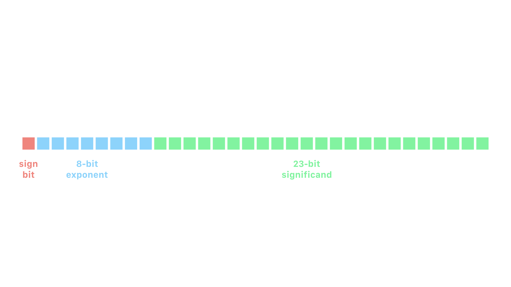

---

# [fit] Next representable `Float`


---

## Number
## Theory

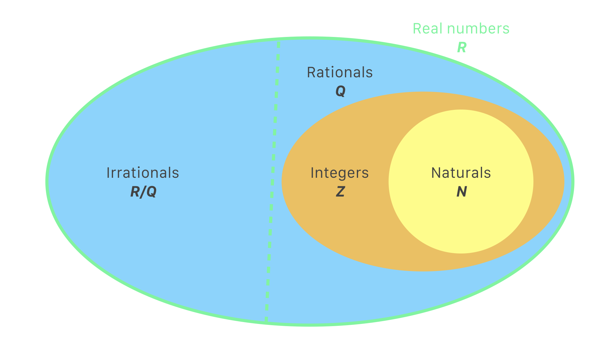

^All sets are infinite, but bounded by min/max constants
Irrationals repeat forever

---

## Swift's numeric
## types

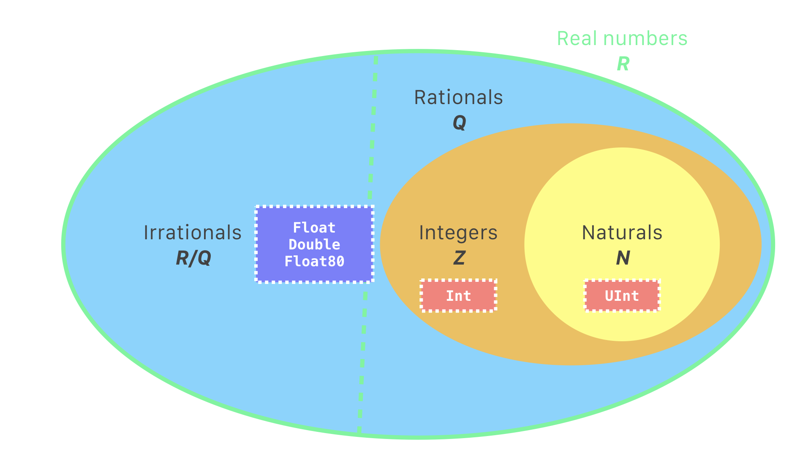

---

## **Infinite** number of values between any two **floating-point** values

In mathematics, but not in computing


^^All numerics are bounded by their respective min and max.
Ints have nothing in-between because they are exact.
Float have infinitely many values in-between them!
Irrationals repeat forever!
Bounds of min/max don't matter for floats, because they are inf

---

# More numbers between
# **0** and **1** than the
# **entire** set of integers 😱
<br>
# **R/Q** + **Q** > **Z**

---

# [fit] But we only have 32 bits! 😱

(or 64 bits)


---

# We have to *round* because

# **not all values can be represented.**

# Thus, we need `ulp`.

(also, silicon chips are obviously finite)

---

# Back to that **Quiz** 🤓

```swift
let f = Float(0.1)
var sum = Float(0.0)
for _ in 0..<10 {
    sum += f
}
// sum == ?
```
# [fit] `1.00000011920928955078125`

^Remember, each add is an opportunity for rounding error

---

# **`Float(1.0).ulp`**

# [fit] **`0.00000011920928955078125`**

# `sum`
# [fit] `1.00000011920928955078125`
<br>
### the ulp of one

---

# [fit] `1.0 + .ulp = 1.00000011920928955078125`
# OMG


---

# [Defining `ulp`](https://en.wikipedia.org/wiki/Unit_in_the_last_place#Definition)

## **`epsilon * radix^exp`**

#### *The distance from a value to the next representable value.*

```swift
let value = Float(3.1415)
let computedUlp = Float.ulpOfOne * powf(Float(Float.radix), Float(value.exponent))

value       // 3.14149999618530273437500
computedUlp // 0.00000023841857910156250
value.ulp   // 0.00000023841857910156250
```

---

# [fit] Next representable value: **`.nextUp`**

```swift
protocol FloatingPoint {
    var nextUp: Self { get }
}

let value = Float(1.0)
value.ulp           // 0.00000011920928955078125
value + value.ulp   // 1.00000011920928955078125
value.nextUp        // 1.00000011920928955078125
```

---

# Precision varies

The precision of a floating-point value is proportional to its magnitude. The larger a value, the less precise.

```swift
let f1 = Float(1.0)
f1.ulp   // 0.00000011920928955078125

let f2 = Float(1_000_000_000.0)
f2.ulp   // 64.0
```

---

# **Comparing for equality:**
# the big problem

No silver bullet! 😭

- Comparing against zero, use absolute epsilon, like `0.001`

- ‼️ Never use `.ulpOfOne` (`FLT_EPSILON`) as tolerance

- Comparing against non-zero, use relative ULPs

---

# Computing relative ULPs

Adjacent floats have integer representations that are adjacent.

Subtracting the integer representations gives us the number of ULPs between floats.

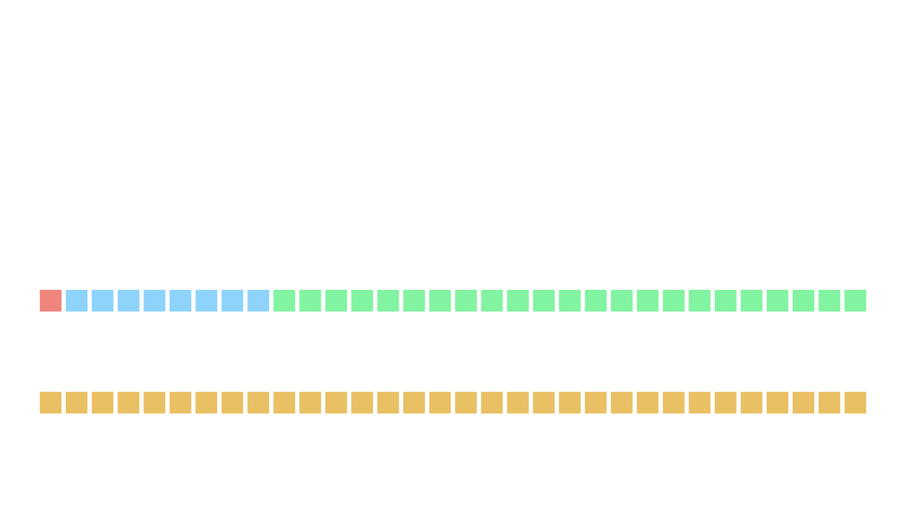

---

# Computing relative ULPs

```swift
extension Float {
    var asInt32: Int32 {
        return Int32(bitPattern: self.bitPattern)
    }
}
```

**NOTE:** *This is not perfect.*
Some edge cases to handle (e.g., negatives, which are two's complement)

---

# **Comparing** relative ULPs

```swift
let f1 = Float(1_000_000.0)
let f2 = f1 + (f1.ulp * 5) // 1_000_000.31250

//  1232348160 - 1232348165
abs(f1.asInt32 - f2.asInt32) // 5 ULPs away
```


^5 "units in the last place"

---

# **Comparing** relative ULPs

- If **zero**, floats are exact same binary representation
- If **one**, floats are as close as possible without being equal
- If **more than one**, floats (potentially) differ by orders of magnitude

## [fit] `If <= 1 ulp, consider them equal`

^If 0 ulps, then they are equal!
If 1 ulp difference, then as close as they can possibly be without being equal
More than 1 ulp -> 😭

---

# [fit] Precision is hard. **Equality is harder.**


<br><br><br><br><br><br>
<br><br><br><br><br><br>

The Swift Standard Library provides great APIs for exploring the layout and implementation of numeric types. Open a Playground and try it out!

---

# [fit] **References** & Further reading

**The rabbit hole goes much deeper!**

- [*Comparing Floating Point Numbers, 2012 Edition*](https://randomascii.wordpress.com/2012/02/25/comparing-floating-point-numbers-2012-edition/), Bruce Dawson
- [*Floating Point Demystified, Part 1*](http://blog.reverberate.org/2014/09/what-every-computer-programmer-should.html), Josh Haberman
- [*What Every Computer Scientist Should Know About Floating-Point Arithmetic*](http://docs.oracle.com/cd/E19957-01/806-3568/ncg_goldberg.html), David Goldberg
- [*Floating Point Visually Explained*](http://fabiensanglard.net/floating_point_visually_explained/), Fabien Sanglard
- [*Lecture Notes on the Status of IEEE 754*](https://people.eecs.berkeley.edu/~wkahan/ieee754status/IEEE754.PDF), Prof. W. Kahan, UC Berkeley
- [IEEE-754 Floating Point Converter](https://www.h-schmidt.net/FloatConverter/IEEE754.html)

---

# **Thanks!**

*Jesse Squires*

**jessesquires.com** • **@jesse_squires**
<br>
*Swift Weekly Brief:*

**swiftweekly.github.io** • **@swiftlybrief**


