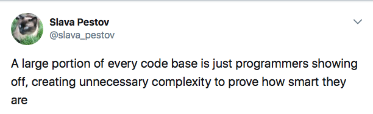

theme: Work, 3
autoscale: true
build-lists: false
slidenumbers: false

# [fit] **ADAPTING TO CHANGE**
# [fit] *DESIGNING FOR MODULARITY*
# [fit] *AND MAINTAINABILITY IN SWIFT*

**Jesse Squires**
*jessesquires.com* • *@jesse_squires*

---

# _*Where I work*_
### Construction productivity software
### *It's like GitHub and Xcode for construction*


^Construction productivity software
Like git, github, IDE for construction

---

# [fit] **CONSTRUCTION** 🚧
# [fit] *AND* **SOFTWARE** 👨‍💻
# [fit] HAVE MANY THINGS
# [fit] *IN* **COMMON**

^issues, bugs, reports, meetings, design
^constantly dealing with and adapting to changes

---

# [fit] CONNECTING
# [fit] **MODEL**
# [fit] _AND_ **UI**
# [fit] LAYERS


^Many different components that need to work together

---

# [fit] FORGETTING
# [fit] TO IMPLEMENT
# [fit] **ACCESSIBILITY**
# [fit] _FEATURES_


^We need to consider our users' accessibility

---

# [fit] CLIENT-SEVER **COMMUNICATION**
# [fit] *MANY DIFFERENT TEAMS WORKING TOGETHER*


^We work across multiple teams to complete a feature/product

---

# [fit] WHEN A NEW
# [fit] FEATURE HAS
# [fit] **USER PRIVACY**
# *OR*
# [fit] **USABILITY**
# [fit] _ISSUES_


^We have to address privacy and design issues
Sometimes a design seems great in concept, but not so great in practice

---

# [fit] WHEN BAD
# [fit] **ARCHITECTURE**
# [fit] *AND* **DESIGN**
# [fit] DECISIONS
# [fit] *CREATE BUGS*


^We create bugs and need to refactor
Yes, **buildings have bugs**.

---

# [fit] DESIGNING
# [fit] **BUILDING**
# [fit] PROTOTYPING
# [fit] **VERIFYING**

---

### **WE ARE ALWAYS**
# [fit] *ADAPTING TO*
# [fit] **CHANGE** 𝚫

(and paying off technical debt)


---

# [fit] So, you're writing some sweet codes 🤓


---

# [fit] And everything is going **great** 😎


---

# [fit] Then you **hit a wall**
(but, not because the Swift compiler is slow)


---

# [fit] **YOU ARE STUCK** 😐
# [fit] You need a huge **hack** or a huge **refactor**


---

# [fit] How can we
# [fit] **prevent**[^*] this?

We can't! *LOLOLOLOLOLOLOL* 🤡

But, we can try.


[^*]: *Make it slightly less terrible*

---


^All pros/cons
No magic solutions
hybrid approaches are great, usually more practical

---

# [fit] *All of these architectures*
# [fit] *have the same goals*
# [fit] **SEPARATATION**
# [fit] **OF CONCERNS**
# [fit] *AND* **CLEAR DATA FLOW**

---

# [fit] **S O L I D**
# [fit] DESIGN PRINCIPLES

Applicable to object-oriented _**and**_ functional programming!


^typically refers to OO, but works for FP too

---

# **S**INGLE RESPONSIBILITY
# **O**PEN / CLOSED
# **L**ISKOV SUBSTITUION
# **I**NTERFACE SEGREGATION
# **D**EPENDENCY INVERSION

---

# [fit] **S**ingle responsibility

Any `type` you create should only have **one reason** to change

---

# [fit] **S**ingle responsibility ❌

```swift
class ImageDownloader {

    let cache: [URL: UIImage]
    let fileManager: FileManager
    let session: URLSession

    func getOrDownloadImage(url: URL,
                            completion: @escaping (UIImage?) -> Void)
}
```

---

# [fit] **S**ingle responsibility ✅

```swift
class Downloader<T> {
    func downloadItem(url: URL, completion: @escaping (Result<T>) -> Void)
}

class Cache<T> {
    func store(item: T, key: String, completion: @escaping (Bool) -> Void)

    func retrieveItem(key: String, completion: @escaping (Result<T>) -> Void)
}

class DataProvider<T> {
    let downloader: Downloader<T>
    let cache: Cache<T>

    func getItem(url: URL, completion: @escaping (Result<T>) -> Void)
}
```

---

# [fit] **S**ingle responsibility ❌

```swift
extension UIImage {
    func cropFilterTransformAndExportPNGData(
            size: CGSize?,
            filter: CIFilter?,
            transform: CGAffineTransform?) -> Data
}

let png = img.cropFilterTransformAndExportPNGData(size: s,
                                                  filter: f,
                                                  transform: t)
```

---

# [fit] **S**ingle responsibility ✅

Easy to **reason** about each small function **individually**

```swift
extension UIImage {
    func crop(to size: CGSize) -> UIImage

    func transform(_ t: CGAffineTransform) -> UIImage

    func filter(_ f: CIFilter) -> UIImage

    func asPNGData() -> Data
}

let pngData = img.crop(to: size).transform(t).filter(f).asPNGData()
```

---

# [fit] **Open** for extension
# [fit] **closed** for modification

How can we change behavior without modifying a type?

- Subclass 😭
- Inject dependency
        - protocols
        - closures

---

# [fit] **O**pen / closed

Using enums as configuration ❌

```swift
enum MessagesTimestampPolicy {
    case all
    case alternating
    case everyThree
    case everyFive
}

class MessagesViewController: UIViewController {
    var timestampPolicy: MessagesTimestampPolicy
}
```

---

Need to implement switch statements __everywhere__ 😭
Every time you add a new `case` you have to update all `switch` statements

```swift
class MessagesViewController: UIViewController {

    func timestampFor(indexPath: IndexPath) -> Date? {
        switch self.timestampPolicy {
            case .all:
            // ...
            case .alternating:
            // ...
            case .everyThree:
            // ...
            case .everyFive:
            // ...
        }
    }

    // ...
}
```

---

# [fit] **O**pen / closed

A simpler, more flexible design: **configuration objects**

```swift
struct MessagesTimestampConfig {
    let timestamp: (IndexPath) -> Date?

    let textColor: UIColor
    let font: UIFont
}

func applyTimestampConfig(_ config: MessagesTimestampConfig)
```

---

# [fit] **L**iskov substitution

Types should be **replaceable** with instances of their **subtypes** without altering **correctness**

---

# [fit] **L**iskov substitution

🤢 Adding a new message type makes program *incorrect*

```swift
class Message { }
class TextMessage: Message { }
class PhotoMessage: Message { }

if model is TextMessage {
    // do text things
} else if model is PhotoMessage {
    // do photo things
} else {
    fatalError("Unexpected type \(model)")
}
```

---

# [fit] **L**iskov substitution

```swift
enum MessageContent { /* ... */ }

protocol Message {
    var content: MessageContent { get }
}

class TextMessage: Message {
    var content: MessageContent { return self.text }
}

class PhotoMessage: Message {
    var content: MessageContent { return self.photo }
}

let content = message.content
// use content...
```

^Now, adding a VideoMessage type is easy

---

# [fit] **I**nterface segregation

Use many specific interfaces, rather than one general purpose interface

```swift
protocol UITableViewDataSource {
    func tableView(_, cellForRowAt: ) -> UITableViewCell
    func numberOfSections(in: ) -> Int
    func tableView(_, numberOfRowsInSection: ) -> Int
}

protocol UITableViewDataSourceEditing {
    func tableView(_, commit: , forRowAt: )
    func tableView(_, canEditRowAt: ) -> Bool
}
```

---

# [fit] **D**ependency inversion

Write against interfaces, not concrete types
Decouple via protocols and dependency injection

```swift
class MyViewController: UIViewController {

    let sessionManager: SessionManagerProtcool

    init(sessionManager: SessionManagerProtcool = SessionManager.shared) {
        self.sessionManager = sessionManager
    }

    // ...
}
```

---

# [fit] **INTERTWINED** COMPONENTS
# [fit] EXPONENTIALLY INCREASE
# [fit] **COGNITIVE LOAD**
# [fit] AND INCREASE THE
# [fit] **MAINTENANCE BURDEN**


---

# *FINALLY*
# [fit] LET'S TALK ABOUT
# [fit] **CLARITY**

> "It was hard to write, it should be hard to read."

---

# [fit] Example: **drawing line graphs** 📈

```swift
let p1 = Point(x1, y1)
let p2 = Point(x2, y2)
let slope = p1.slopeTo(p2)

```

*Need to check if the slope is:*

- undefined (vertical line)
- zero (horizontal line)
- positive
- negative

---

*We could write code like this*

```swift
if slope == 0 {
    // slope is a horizontal line
    // do something...

} else if slope.isNaN {
    // slope is undefined, a vertical line
    // handle this case...

} else if slope > 0 {
    // positive slope

} else if slope < 0 {
    // negative slope
}
```

---

*Or, we could add extensions for our __specific domain__*

```swift
extension FloatingPoint {

    var isUndefined: Bool { return isNaN }

    var isHorizontal: Bool { return isZero }
}

extension SignedNumeric where Self: Comparable {

    var isPositive: Bool { return self > 0 }

    var isNegative: Bool { return self < 0 }
}
```

---

*And then __remove__ the comments.*

```swift
if slope.isHorizontal {

} else if slope.isUndefined {

} else if slope.isPositive {

} else if slope.isNegative {

}
```

_**This code reads like a sentence.**_

---

# [fit] Another example: **dynamic collection layout**

```swift
func getBehaviors(for
     attributes: [UICollectionViewLayoutAttributes]) -> [UIAttachmentBehavior] {
    // get the attachment behaviors
    return self.animator.behaviors.flatMap {
        $0 as? UIAttachmentBehavior
        }.filter {
            // remove non-layout attribute items
            guard let item = $0.items.first
                as? UICollectionViewLayoutAttributes else {
                    return false
            }
            // get attributes index paths
            // see if item index path is included
            return !attributes.map {
                $0.indexPath
                }.contains(item.indexPath)
    }
}
```

---

```swift
extension UIAttachmentBehavior {
    var attributes: UICollectionViewLayoutAttributes? { /* ... */ }
}

extension UIDynamicAnimator {
    var attachmentBehaviors: [UIAttachmentBehavior] { /* ... */ }
}

func getBehaviors(for
     attributes: [UICollectionViewLayoutAttributes]) -> [UIAttachmentBehavior] {

    let attributesIndexPaths = attributes.map { $0.indexPath }
    let attachmentBehaviors = self.animator.attachmentBehaviors

    let filteredBehaviors = attachmentBehaviors.filter {
        guard let attributes = $0.attributes else { return false }
        return !attributesIndexPaths.contains(attributes.indexPath)
    }

    return filteredBehaviors
}
```

---

# [fit] *WHEN YOU START TO WRITE*
# [fit] **A COMMENT**
# [fit] *SEE IF YOU CAN WRITE*
# [fit] **CODE** *INSTEAD*

---

# [fit] COMMENTS CAN GET **STALE**
# [fit] BUT **CODE** DOESN'T LIE

```swift
// show prompt if user has permissions
if !user.hasPermissions {
    displayPrompt()
}
```

🤔

---

# [fit] Only add comments to truly
# [fit] **exceptional** or **non-obvious** code

```swift
// Intentionally not a struct!
// Using immutable reference types for performance reasons
final class Message {
    let uid: UUID
    let timestamp: Date
    let sender: User
    let text: String
}
```

---

# Keep it small and simple
# **Write code, not comments**
# Separate components
# **Inject dependencies**
# Avoid over-abstraction
# **Avoid unnecessary complexity**


^software is necessarily complex. complexity is ok. avoid being complicated.

---

## When programmers get **bored**, they find ways to make **easy** things more **complicated**. 🙃



^https://mobile.twitter.com/slava_pestov/status/921810703823941632

---

# [fit] *Thanks!*

*Jesse Squires*
**@jesse_squires** • **jessesquires.com**

*Swift Unwrapped*
**@swift_unwrapped**

*Swift Weekly Brief*
**@swiftlybrief** • **swiftweekly.github.io**


